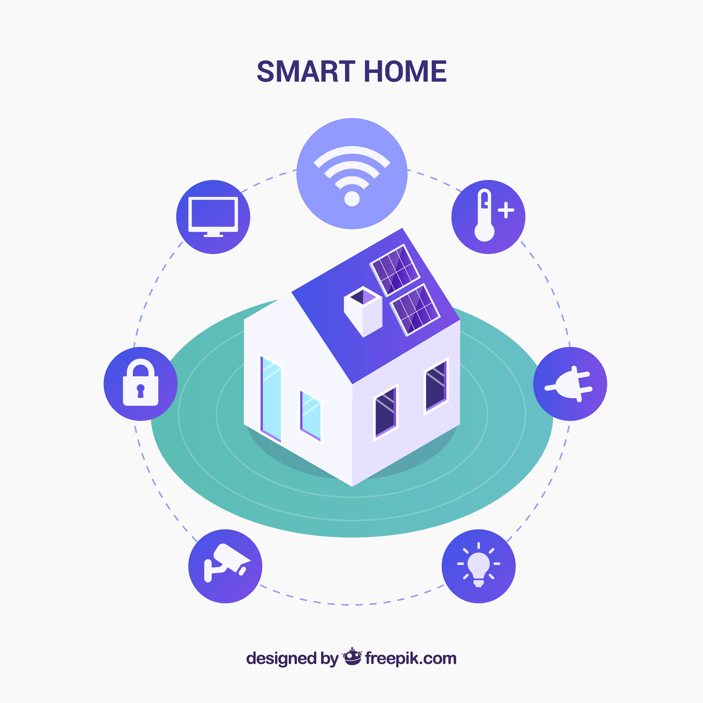

# Sistema de sensoriamento e segurança com domótica -- Projeto Integrador II

Este repositório implementa um projeto de domótica, que será relizado na disciplina de projeto integrador 2 para fins didáticos

Acesso rápido:
  - [Concepção](./doc/concepcao.md)
  - [Design/Projeto](./doc/design.md)
  - [Implementação](./doc/implementacao.md)
  - [Operação](./doc/operacao.md)

## Domótica
Com o aumento da tecnologia o ser humano evoluiu as residências para aumentar o conforto e segurança, desde as cavernas que protegiam da intempérie até a modernidade onde tarefas cotidianas são automatizadas por sistemas mecatrônicos, essa tecnologia é chamada de dómotica.

Domótica é a automatização de tarefas no ambiente residencial, a união da mecânica, eletrônica e elétrica permite facilitar tarefas cotidianas como acender luzes, controlar a temperatura ou acionar sistemas de segurança que tem como objetivo aumentar o conforto e segurança dos usuários.

Para aplicar esses objetivos o sistema pode ser abstraído em diferentes grupos:
<ul>
  <li> Sensores
  <ul>
    <li> São a interface que o sistema tem com o ambiente, eles vão pegar os estímulos que serão usados pelo sistema para tomar as decisões. Usando uma analogia com o corpo humano seriam os sentidos.
  </ul>
  <li>Atuadores
  <ul>
    <li> São os componentes que irão responder as decisões do sistema. Usando uma analogia com o corpo humano seriam os músculos. 
  </ul>
  <li> Controladores
  <ul>
    <li> Os controladores são a lógica do sistema, que irão tomar as decisões que dependendo dos estímulos dos sensores irá atuar nos atuadores.
  </ul>
  <li> Visualizadores 
  <ul>
    <li> Os visualizadores dão um feedback para o usuário do comportamento do sistema.
  </ul>
</ul>

## Referências
<a href='https://www.freepik.com/vectors/background'>Background vector 
created by freepik - www.freepik.com</a>

TEZA, Vanderlei Rabelo. **ALGUNS ASPECTOS SOBRE A AUTOMAÇÃO RESIDENCIAL - DOMÓTICA**. 2002. 108 f. Dissertação (Mestrado) - Curso de Ciência da Computação, Universidade Federal de Santa Catarina, Florianópolis, 2002.

