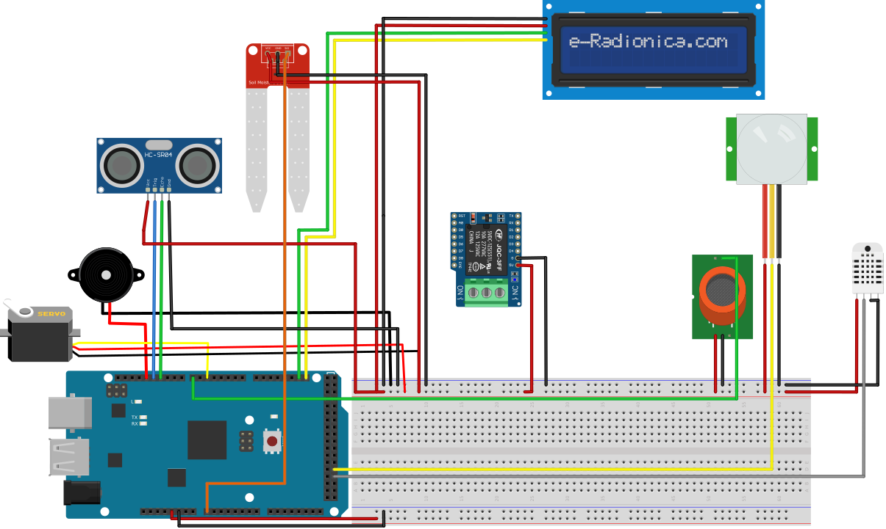
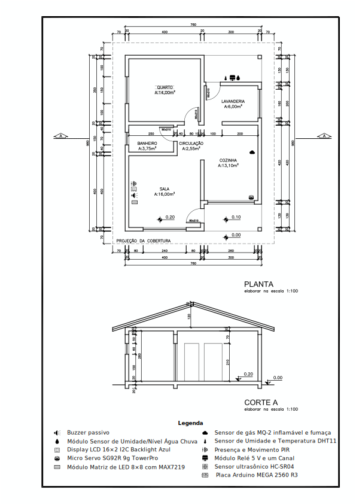

# Design

Acesso rápido:
  - [Introdução](../README.md)
  - [Concepção](./concepcao.md)
  - [Implementação](./implementacao.md)
  - [Operação](./operacao.md)

Os conceitos definidos na concepção integram os diversos sistemas para a concretização do projeto. Para isto, um diagrama eletrônico foi feito possibilitando definir as ligações entre os diferentes módulos. Além disso, uma planta baixa para definir o espaço físico e localização dos componentes foi feita.

Quantidade  | Tecnologias
:---------:   | ------
1           | Placa Arduino MEGA 2560 R3
1           | Micro Servo SG92R 9g TowerPro
1           | Sensor ultrassônico HC-SR04
1           | Buzzer passivo
1           | Módulo Sensor de Umidade/Nível Água Chuva
1           | Módulo Relé 5 V e um Canal
1           | Display LCD 16×2 I2C Backlight Azul
1           | Sensor de gás MQ-2 inflamável e fumaça
1           | Presença e Movimento PIR
1           | Sensor de Umidade e Temperatura DHT11

## Diagrama

## Planta Baixa

## Referências

ADMIN. **Casa inteligente: a tecnologia de Black Mirror já está o seu alcance!** Disponível em: <https://www.delmak.com.br/casa-inteligente-a-tecnologia-de-black-mirror-ja-esta-ao-seu-alcance/>. Acesso em: 23 mai. 2021.
