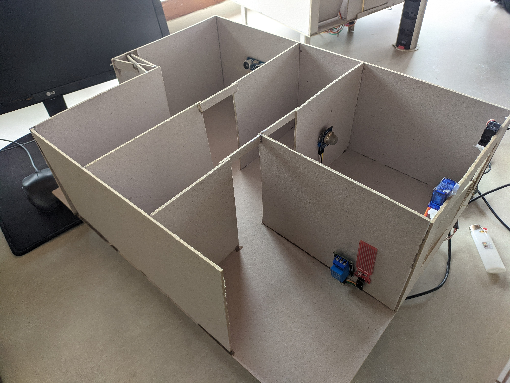
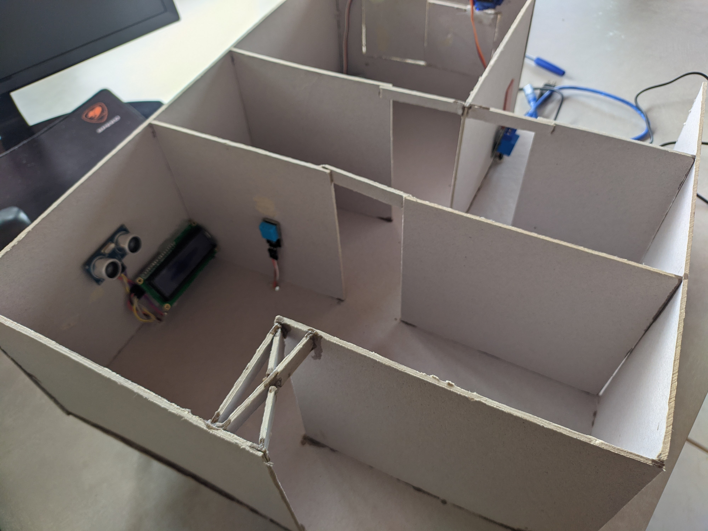
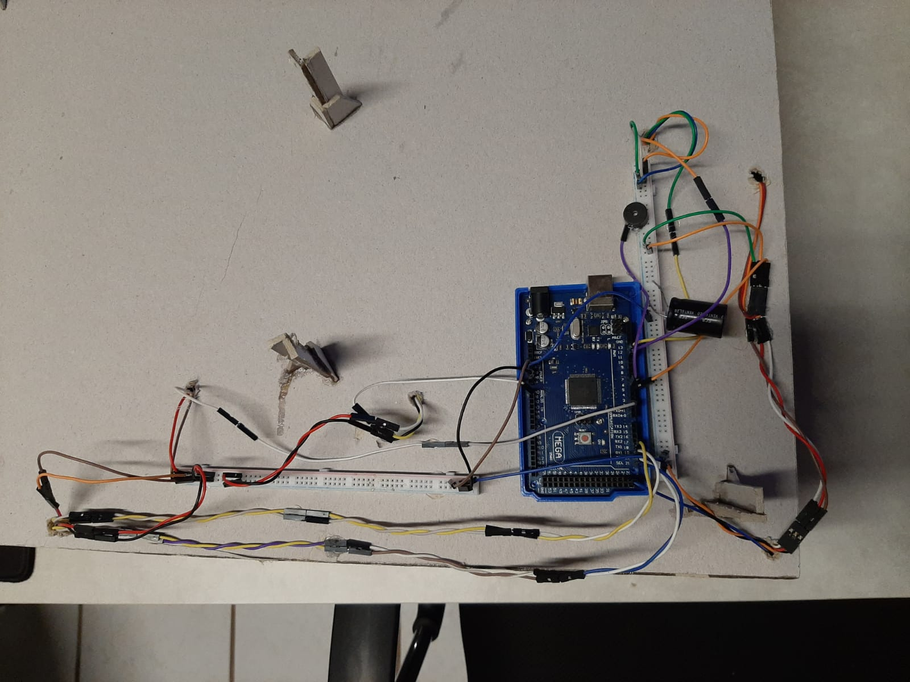

# Implementação do Projeto

Acesso rápido:
  - [Introdução](../README.md)
  - [Concepção](./concepcao.md)
  - [Design/Projeto](./design.md)
  - [Operação](./operacao.md)

Primeiramente, com as informações da concepção e do design, foi idealizado como seria a integração dos diferentes sistemas para a aplicação em uma maquete. Para a aplicação, foram testados todos os sensores e atuadores individualmente para depois fazer a integração em uma protoboard onde foi integrado cada sensor individualmente em diferentes tarefas. Após ter verificado o funcionamento global do sistema, a maquete foi confeccionada e, por último, os sensores e atuadores na maquete foram instalados.

## Testes individuais

Para reduzir possíveis problemas, todos os sensores e atuadores foram testados de forma individual.

## Teste e implementação do conjunto

Após ter o funcionamento correto de todos os módulos separados, estes foram implementados em conjunto, visando a modularidade. Para isso, várias tarefas foram criadas para que os sensores e atuadores trabalham em conjunto. Para uma melhor organização do código um fluxograma foi criado.

### Machine

A lógica está toda na função machine que é chamada a cada 1ms. 
Cada sensor ou atuador tem uma task que é chamada com um tempo específico, analisado de forma empírica, para ter seu funcionamento como o desejado. 

### Sensores

Para cada sensor, uma amostra na frequência do loop do arduino é coletada, para depois ser feita uma média aritmética, assim mantendo uma medição mais precisa e mais estável.
Também cada sensor tem uma variável de trigger, que é acionada quando o sensor passa por um valor desejado, por exemplo, no sonar, quando chega na distância desejada para ligar o display essa variável é igualada a 1, e na maioria dos sensores, para ter um funcionamento mais confortável para o cliente, eles têm um tempo de espera para voltar o trigger a 0.

Sensores binários, como o PIR tem um  funcionamento levemente diferente. Em vez de fazer uma média aritmética é feito uma média fazendo a soma de todas as medições, que sendo binário são 0 e 1, e depois é verificado se a soma é maior ou menor que metade dos samples, assim é possível filtrar o sensor mantendo ele binário. 

### Atuadores

Cada atuador tem sua lógica de atuação dentro da sua task, e cada vez que algum atuador precisa de algum sensor calcula a média com a função *sensor*_calculate_avg().

### Lógica

Tem três sistemas principais:
- Display apresentando as informações.
- Sistema de segurança para fuga de gás e incêndio
- Sistema de regamento automático

Display:
- Funcionamento normal:
  - Backlight liga quando tem alguém na frente (sendo detectado com o sensor ultrassônico)
  - Quando o usuário sai da frente, o backlight fica ligado por um tempo e desliga (esse tempo foi visto necessário para ter um comportamento mais agradável para o usuário).
- Funcionamento com fuga de gás ou foco de incêndio:
  - Backlight ficará intermitente para avisar ao usuário que tem uma mensagem urgente no display
  - Aparecerá uma mensagem no display para avisar o usuário.
  - Quando seja detectado que não tem fuga de gás depois de um tempo voltará ao funcionamento normal.

Sistema de segurança para fuga de gás e incêndio:
- Com fuga de gás e sem pessoas no local:
  - Ligará um alarme sonoro com o buzzer, até certo tempo sem ser detectado gás.
  - Se não for detectado uma pessoa, as janelas ficarão fechadas (pois, o sensor não diferencia entre fuga de gás GLP e de fumaça, então se for um caso de incêndio o melhor comportamento seria manter a janela fechada para diminuir o oxigênio do incêndio).
- Com fuga de gás e com pessoas no local:
  - Ligará um alarme sonoro com o buzzer, até certo tempo sem ser detectado gás.
  - Se for detectado uma pessoa (com o sensor PIR) as janelas serão abertas (com os servos) ventilando o local, as janelas ficarão abertas por um tempo permitindo que todo o gás possa ser ventilado. 

Sistema de regamento automático:
- A bomba de água será ligada quando for detectado que o solo está seco. Quando for detectado que o solo está úmido será esperado um tempo e será desligada a bomba. (O tempo de espera é para não ocorrer o caso onde a umidade está muito próxima do limiar onde será acionada a bomba e que ligue a bomba e em seguida desligue, assim oscilando podendo ocorrer um estresse excessivo na bomba).

### Biblioteca AVR

Para manter um melhor controle nas funcionalidades, a biblioteca AVR foi utilizada para ter controle nos periféricos do Atmega2560 (microcontrolador do Arduino mega), não foi utilizado o TIMER 0 nem o TIMER 2, pois são utilizados pela biblioteca arduino, um para a função milis e outro para o Tone.

Foram configurados dos timers, o timer 3 para o controle do sonar e o servo e o timer 1 para o controle da chamada da função machine.

O timer 3 foi utilizado principalmente porque se não for usar os timers para o sonar teria que usar a função pulseIn, que bloqueia o fluxo. E para não causar incompatibilidade com a biblioteca servo, foi controlado o servo com o mesmo timer, já que vai ser controlado somente um pulso. O timer foi configurado no modo PWM Phase Correct assim é possível configurar a frequência do pulso do servo com o registrador ICR3 e a largura com o registrador OCR3A. Para capturar o pulso do echo foi utilizada a interrupção INT2 que captura o valor do timer na borda de subida e de descida o pulso.

O timer 1 foi utilizado para capturar os milissegundos e para acionar a função machine_run a cada 1ms. Foi calculado em modo CTC, para poder usar o registrador OCR1A para chamar a interrupção a cada 1ms.

## Fabricação da maquete

Para a fabricação da maquete foi utilizada a planta baixa apresentada no design. Para a confecção foi utilizado Papel Panamá em conjunto de cola instantânea e cola quente para unir as peças e módulos. Como é uma maquete demonstrativa a casa foi fracionada horizontalmente para uma melhor visualização. 

Toda a fiação e o arduino foram colocados na parte inferior da maquete.

## Referências

ADMIN. **Casa inteligente: a tecnologia de Black Mirror já está o seu alcance!** Disponível em: <https://www.delmak.com.br/casa-inteligente-a-tecnologia-de-black-mirror-ja-esta-ao-seu-alcance/>. Acesso em: 23 mai. 2021.

ATMEL. **Atmel ATmega640/V-1280/V-1281/V-2560/V-2561/V** Disponível em: <https://ww1.microchip.com/downloads/en/devicedoc/atmel-2549-8-bit-avr-microcontroller-atmega640-1280-1281-2560-2561_datasheet.pdf/>. Acesso em: 01 mar. 2022.