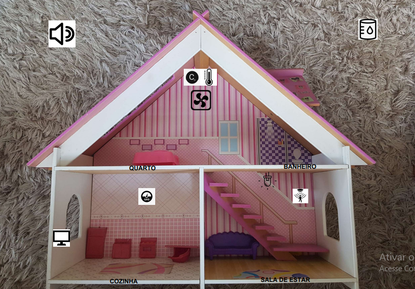
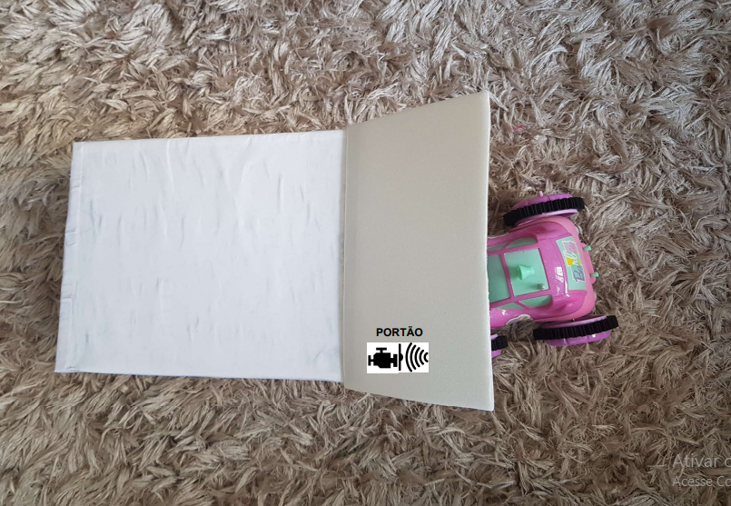
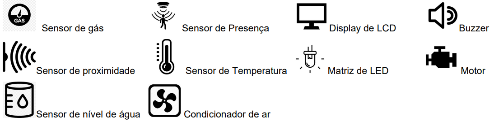

# Design

Utilizaremos os seguintes componentes eletrônicos para confecção do projeto previamente definido:

-Placa MEGA 2560 R3 + Fonte + Cabo USB para Arduino

-Sensor de Umidade e Temperatura DHT11

-Sensor de presença e movimento PIR

-Sensor de gás MQ-2 inflamável e fumaça

-Micro Servo SG92R 9g TowerPro

-Módulo Sensor de Umidade/Nível Água Chuva

-Sensor ultrasônico HC-SR04

-Módulo Matriz de LED 8×8 com MAX7219

-Buzzer passivo

-Display LCD 16×2 I2C Backlight Azul

-LED com resistor

Através da maquete eletrônica planejamos as conexões entre os materiais na etapa da implementação. A seguir, será apresentada uma breve explicação de cada componente que compõe o projeto e o motivo pelo qual eles foram selecionados:

* Arduino Mega 2560: Irá controlar e receber as informações nos seus pinos de entrada e saída. O Arduino Mega 2560 possuí a configuração ideal para o projeto, possuí maior quantidade de memória, se comparado ao Arduino Uno.

* Servo TowerPro MG995: É controlado por um pino de saída digital PWM e será o responsável pela abertura do galpão. Modelo alimentado com 5V, que é a mesma tensão que o arduino fornece, além de seu tamanho reduzido geram facilidades para essa aplicação.

* HC-sr501: Esse é o modelo do sensor de presença que será utilizado, alimentado com 5V e é conectado a um pino de entrada digital. Quando detectado algum movimento ele enviará nível lógico alto para o arduíno.

* MQ2: Sensor de gás que identifica gás de cozinha. Conectado a um pino de entrada digital, que receberá nível lógico alto quando for detectado gás e um pino de entrada analógica que receberá a concentração de gás verificada pelo sensor.

* DHT11: Sensor de temperatura e umidade alimentado com 5V, ele envia os dados registrados por um pino de entrada analógica.

* Módulo Buzzer Passivo 5V : Controlado por um pino de saída digital PWM, emitirá sons para alertar o usuário, nesse caso, sobre um vazamento de gás.

* Display LCD 16x2 I2C: O display LCD com módulo I2C integrado, faz a conexão utilizando apenas quatro pinos. Dois para alimentação e os outros dois para comunicação. O display LCD será resposável por exibir o volume em litros da água da chuva armazenada.

* Módulo sensor de nível de água: Analogicamente irá informar ao Arduino o volume de água no reservatório de água da chuva, que mostrará no Display a quantidade em litros.   

Abaixo podemos observar um protótipo do projeto físico:

