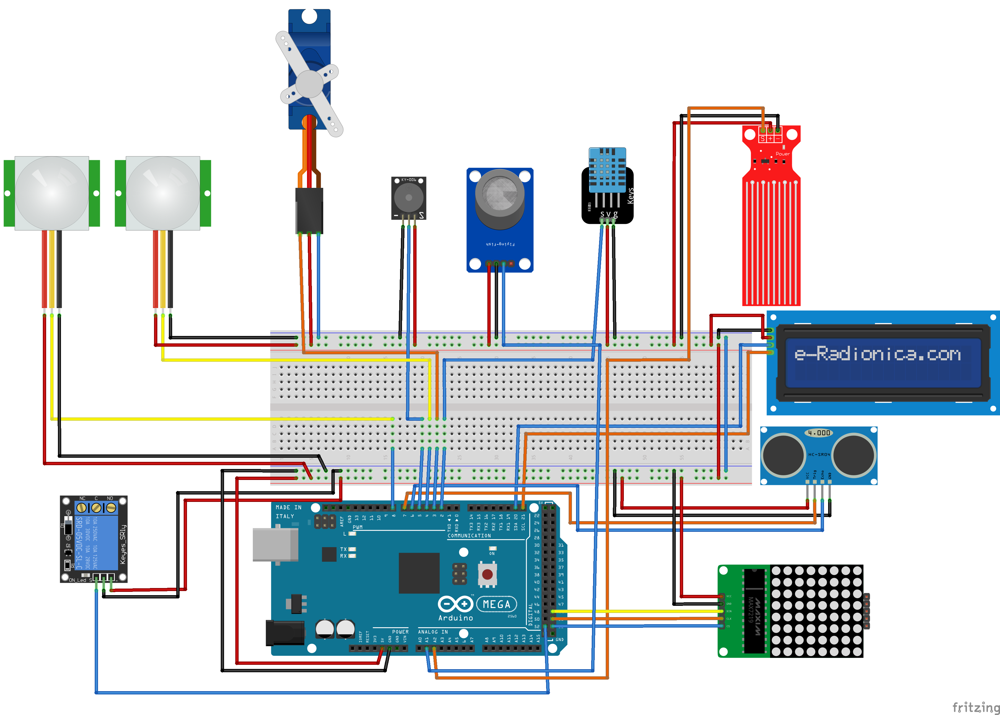
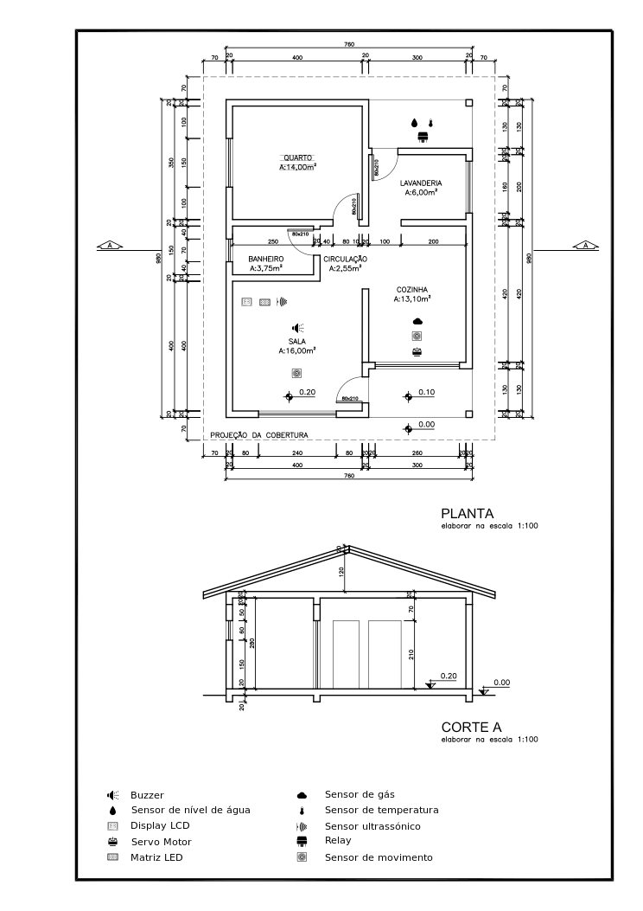

# Design

Acesso rápido:
  - [Início](https://github.com/JoaoMario109/projeto-integrador-2)
  - [Concepção](./conceive.md)
  - [Implementação](./implement.md)
  - [Operação](./operate.md)

## Design

No design será feito a prototipagem do projeto e a montagem do diagrama e estabelecimento da disposição dos
componentes sobre a planta da maquete representando a casa.

## Componentes:

Quantidade  | Tecnologias
:---------:   | ------
1           | Placa Arduino MEGA 2560 R3
1           | Sensor de Umidade e Temperatura DHT11
1           | Sensor de gás MQ-2 inflamável e fumaça
1           | Micro Servo SG92R 9g TowerPro
1           | Módulo Sensor de Umidade/Nível Água Chuva
1           | Módulo Relé 5 V e um Canal
1           | Sensor ultrasônico HC-SR04
1           | Módulo Matriz de LED 8×8 com MAX7219
1           | Buzzer passivo
1           | Display LCD 16×2 I2C Backlight Azul
2           | Presença e Movimento PIR

## Esquemático do projeto:

## Planta baixa:

## Descrição

Conforme descrito na concepção do projeto os componentes necessários apra elaboração do projeto serão conectados conforme mostrado no esquemático do projeto.

A planta baixa representando como será implementado a maquete pode ser encontrada logo abaixo do esquemático, a maquete será implementada seguindo fielmente as dimesnões conforme a planta, apenas ajustando para um tamanho que fique adequado de montar sem passar do tamanho limite desta. A planta baixa também possui a disposição dos componentes em grupos, conforme mostrado na figura, indicando onde cada componente será disposto sobre os cômodos da casa, e ao se realizar a leitura da concepção pode-se deduzir e verificar o uso de cada componente do sistema conforme descrito na concepção do projeto.

