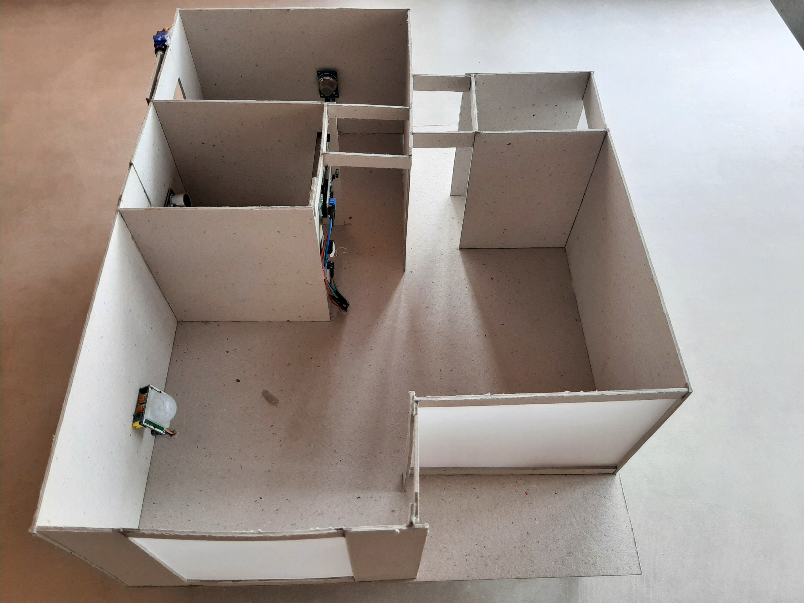
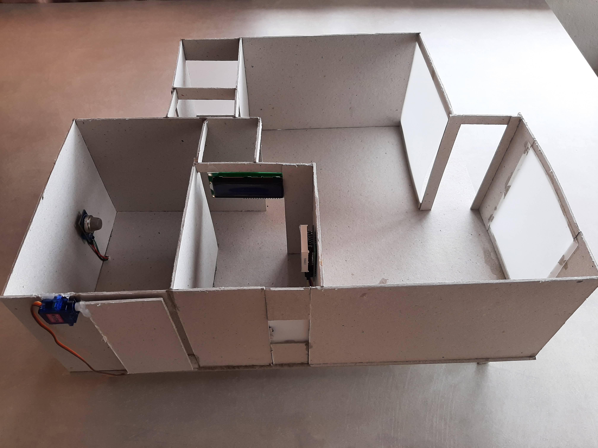
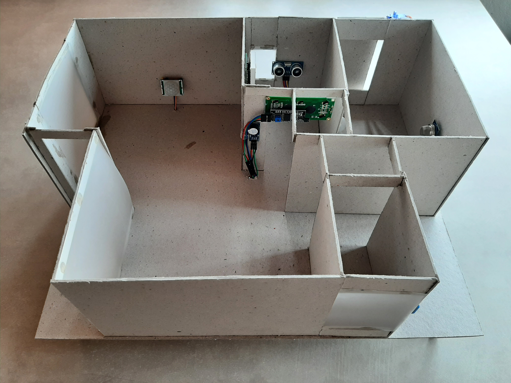
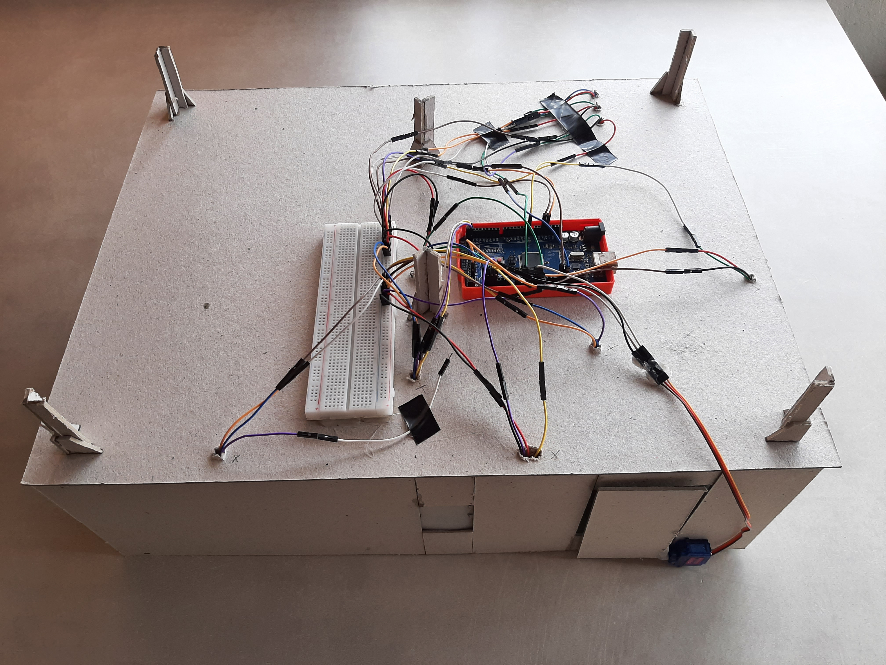
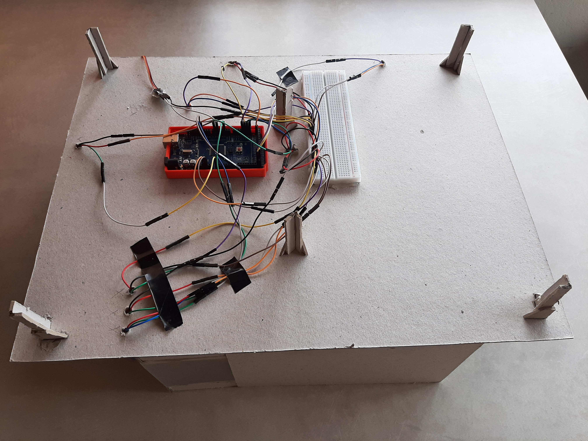

# Implementação do Projeto

Acesso rápido:
  - [Início](https://github.com/JoaoMario109/projeto-integrador-2)
  - [Concepção](./conceive.md)
  - [Design](./design.md)
  - [Operação](./operate.md)

## Implementação

A implementação da casa foi realizada conforme as especificações da planta contida no design e a montagem dos componentes foi realizada conforme o diagrama feito no software fritizing.

## Montagem:

A montagem do projeto foi realizada utilizando o papel Panama, foi utilizado uma folha de 1x0.8 metros e foi feito a escala da planta contida no design para fazer o melhor aproveitamento da folha. Após isso foi feito o recorte a colagem e a implementação dos conceitos que foram abordados na concepção e no design.

## Fotos da montagem:

## Do Código

O código foi feito em .ino, após uma primeira versão desenvolvida em C, por recomendações dos professores, foi feito uma versão em .ino para maior legibilidade, o software utiliza um carater procedural, com uma utilização consideravelmente densa de globais e estáticas, do ponto de vista de um software ou até mesmo de um projeto maior não seria adequado, mas por se tratar de um pequeno software para um ambiente de hardware restrito, é tolerável. Vale ressaltar que para um software maior seria melhor a utilização de uma arquitetura bem mais definida e concisa.
Foi feito a criação de uma macro para auxiliar a setar os temporizadores das tarefas e do resto foi feito uma implementação de um código bem padrão. O código em si está bem auto explicativo e simples, porém adicionei diversos comentários para auxiliar a leitura deste.
Este consite basicamente de procedimentos que atualizam os sensores e o estado da casa (Uma instância global da estrutura com os dados necessários) e outros procedimentos que operam sobre esses dados coletados e tomam ações.

## Extra

Conforme descrito na concepção do projeto os componentes necessários apra elaboração do projeto serão conectados conforme mostrado no esquemático do projeto. Vale ressaltar que além da montagem comum, as dimensões e escalas da planta foram fielmente respeitadas, bem como os conceitos abordados no começo desse repositório, todos os objetivos da concepção foram implementados com sucesso.
<a href="https://youtu.be/zG1UCSqaGcw">Veja o vídeo com a demonstração do projeto aqui.</a>

### Veja também a operação do projeto [aqui](./operate.md)
